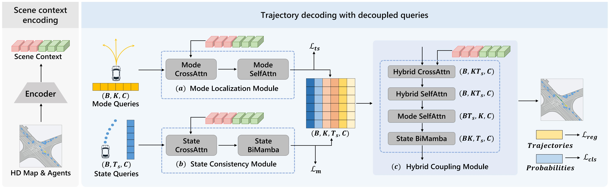
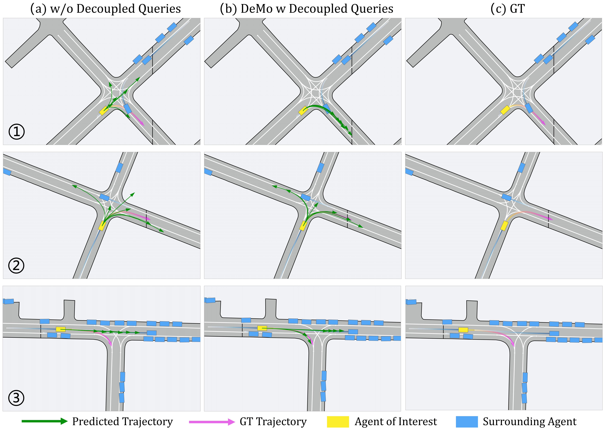

# DeMo: Decoupling Motion Forecasting into Directional Intentions and Dynamic States
### [[Paper]](https://arxiv.org/abs/2410.05982)

> [**DeMo: Decoupling Motion Forecasting into Directional Intentions and Dynamic States**](https://arxiv.org/abs/2410.05982)            
> [Bozhou Zhang](https://zbozhou.github.io/), Nan Song, [Li Zhang](https://lzrobots.github.io)  
> **School of Data Science, Fudan University**  
> **NeurIPS 2024**

## 🚗 Abstract
Accurate motion forecasting for traffic agents is crucial for ensuring the safety and efficiency of autonomous driving systems in dynamically changing environments. Mainstream methods adopt a one-query-one-trajectory paradigm, where each query corresponds to a unique trajectory for predicting multi-modal trajectories. While straightforward and effective, the absence of detailed representation of future trajectories may yield suboptimal outcomes, given that the agent states dynamically evolve over time. To address this problem, we introduce DeMo, a framework that decouples multi-modal trajectory queries into two types: mode queries capturing distinct directional intentions and state queries tracking the agent's dynamic states over time. By leveraging this format, we separately optimize the multi-modality and dynamic evolutionary properties of trajectories. Subsequently, the mode and state queries are integrated to obtain a comprehensive and detailed representation of the trajectories. To achieve these operations, we additionally introduce combined Attention and Mamba techniques for global information aggregation and state sequence modeling, leveraging their respective strengths. Extensive experiments on both the Argoverse 2 and nuScenes benchmarks demonstrate that our DeMo achieves state-of-the-art performance in motion forecasting. 

## 🎞️ Pipeline
<div align="center">
  
</div><br/>

## 🛠️ Get started

### Set up a new virtual environment
```
conda create -n DeMo python=3.10
conda activate DeMo
```

### Install dependency packpages
```
pip install torch==2.1.1 torchvision==0.16.1 torchaudio==2.1.1 --index-url https://download.pytorch.org/whl/cu118
pip install -r ./requirements.txt
pip install av2
```

### Install Mamba
- We follow the settings outlined in [VideoMamba](https://github.com/OpenGVLab/VideoMamba).
```
git clone git@github.com:OpenGVLab/VideoMamba.git
cd VideoMamba
pip install -e causal-conv1d
pip install -e mamba
```

### Some packages may be useful
```
pip install tensorboard
pip install torch-scatter -f https://data.pyg.org/whl/torch-2.1.1+cu118.html
pip install protobuf==3.20.3
```

## 🕹️ Prepare the data
### Setup [Argoverse 2 Motion Forecasting Dataset](https://www.argoverse.org/av2.html)
```
data_root
    ├── train
    │   ├── 0000b0f9-99f9-4a1f-a231-5be9e4c523f7
    │   ├── 0000b6ab-e100-4f6b-aee8-b520b57c0530
    │   ├── ...
    ├── val
    │   ├── 00010486-9a07-48ae-b493-cf4545855937
    │   ├── 00062a32-8d6d-4449-9948-6fedac67bfcd
    │   ├── ...
    ├── test
    │   ├── 0000b329-f890-4c2b-93f2-7e2413d4ca5b
    │   ├── 0008c251-e9b0-4708-b762-b15cb6effc27
    │   ├── ...
```

### Preprocess
```
python preprocess.py --data_root=/path/to/data_root -p
```

### The structure of the dataset after processing
```
└── data
    └── DeMo_processed
        ├── train
        ├── val
        └── test
```

## 🔥 Training and testing
```
# Train
python train.py 

# Val, remember to change the checkpoint to your own in eval.py
python eval.py

# Test for submission
python eval.py gpus=1 test=true
```

## ⭐ Results and checkpoints
- We provide two versions of the models: `DeMo` for [DeMo](https://arxiv.org/abs/2410.05982) itself, and `DeMo+RealMotion`, which integrates [DeMo](https://arxiv.org/abs/2410.05982) with our other work, [RealMotion](https://arxiv.org/abs/2410.06007). You can select which model to use by adjusting the first 3 rows in [config.yaml](https://github.com/fudan-zvg/DeMo/blob/main/conf/config.yaml).

| Models | minADE1 | minFDE1 | minADE6 | minFDE6 |
| :- | :-: | :-: | :-: | :-: |
| [DeMo](https://drive.google.com/file/d/1xqj8T5M2cczIZU26poseAQri6VE6v9a0/view?usp=drive_link)   |  1.578  |  3.961  |  0.645  |  1.247  |
| [DeMo+RealMotion](https://drive.google.com/file/d/131pcHXP-vLcyypZWn6Es7n6TT8bxs4rN/view?usp=drive_link) |  1.478  |  3.728  |  0.607  |  1.186  |

### Qualitative Results
<div align="center">
  
</div><br/>

## 📜 BibTeX
```bibtex
@inproceedings{zhang2024demo,
 title={DeMo: Decoupling Motion Forecasting into Directional Intentions and Dynamic States},
 author={Zhang, Bozhou and Song, Nan and Zhang, Li},
 booktitle={NeurIPS},
 year={2024},
}
```

## ❤️ Acknowledgements
 - [VideoMamba](https://github.com/OpenGVLab/VideoMamba)
 - [Forecast-MAE](https://github.com/jchengai/forecast-mae)
 - [StreamPETR](https://github.com/exiawsh/StreamPETR)
 - [RealMotion (Ours)](https://github.com/fudan-zvg/RealMotion)
